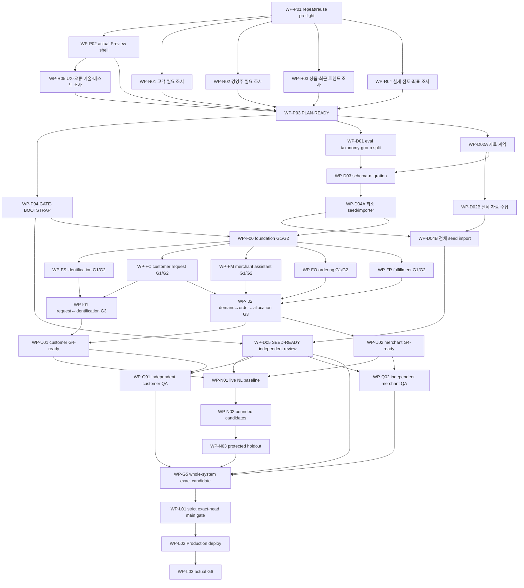

# 실행 Workplan

상태: D-46의 화면 우선 실행 중. 아래 기존 DAG는 최종 검증 목적지이며, 초기 화면·Preview의 선행 차단 조건은 아니다. 제품 게이트는 아직 통과하지 않았다.

## 현재 실행 순서 — D-46

| 순서 | 구현·담당 | 상태·공유 |
|---|---|---|
| UI-01 | 조정자: 공통 화면/역할 전환·메모리 상태. Meitner: 고객 입력/후보/요청. Newton: 경영주 묶음/고객 상세/시연 승인 | `0e43f0d` commit/push·PR #1·Vercel Preview Ready. 실제 화면 로딩 확인, 제품 전체 검증 전 |
| UI-02 | Locke: SQLite 저장/복원·seed 자산·단일 lockfile 작성. 조정자: 화면 연결 | `9c4d41c`·두 번째 Preview Ready, 로컬 저장/복원 및 배포 초기 SQL 확인 |
| UI-03 | Meitner: 서버 OpenAI API. Newton: 두 역할 AI UI. 조정자: 비밀 설정·실호출·배포 | `18b0b31` 고객 및 `bd13e3f` 경영주 실제 AI Preview 성공. 선택/예산 적용과 거래 승인 구분 |
| UI-04 | Meitner: 순수 거래 도메인. Locke: 정규화 SQL·저장 어댑터. Newton: 거래 화면. 조정자: `/demo` 연결·배포 | `b4a2854` 여섯 번째 Preview Ready. 정상 로컬 요청→발주→공급/모의 결제→입고/48시간→수령·새로고침 복원. Preview 별도 시작·이전 이력 보관 확인. 독립 전체 QA 후속 |
| UI-05 | Newton: 점포 지도·가상 위치/직선거리. 조정자 통합 | `1012772` 일곱 번째 Preview Ready. 외부 iframe 두 번 지연 fallback, 주소·거리 및 지도 없이 요청 저장 확인. 정상 지도 렌더 미확인 |
| UI-06 | Meitner: 정책 AI API. Newton: 정책 변경안/확인 UI. 조정자 통합 | `5502200` 여덟 번째 Preview Ready. live1회 변경안→별도 확인→예산1만원/커피1개 자동발주·새로고침 복원, 전체 독립 품질검증 전 |
| UI-07 | Meitner: 제한 대화 API. Locke: domain DTO/기록 명령/SQL migration 단일 작성. Newton: 고객 대화/기록. 조정자: 페이지/경영주 안전 조회 | `81a4369` 아홉 번째 Preview Ready. 실제 로컬v1 수령이력 보존·니즈 등록/경영주 안전조회, Preview live검색1회→검색/선택/구매연결 저장. live추가질문·전체 독립 품질 후속 |
| UI-08 | Locke: 읽기 전용 고객 대기/안전 조회 DTO. Newton: 대기 사유·발음·픽업 위계. 조정자: 통합/Preview | [context/UI-08.md](context/UI-08.md), `e8a5b69` 열 번째 Preview Ready·실제 공급→입고/픽업 확인. `af1dce1` 잔량 우선 안내 보완·열한 번째 Preview Ready·픽업/마감 복원, domain92/needs26/waiting24·독립 좁은 P2 재확인 PASS. 전체 검증 후속 |
| UI-09A | Meitner: 문맥 v2 계약/API. Newton: 최근 변경·정책 전달 UI. 조정자: 통합/Preview | `cfda3c9` 열두 번째 Preview Ready. 최근5개·합집합 복원→명시 적용·정책 확인 전달 실제2호출, OFF/누적예산 유지·수동draft 보존·정책 저장/복원 확인. 조회-only P2 독립 재확인, 전체 품질 후속 |
| UI-09B | Locke: domain/SQL 단일 작성. Newton: 실행 이력 UI. 조정자: 저장 어댑터/통합. Meitner: 좁은 독립 검토 | `9e2b6bf` 열세 번째 Preview Ready. trace58/UI13·실제 SQL v1/v2→3 보존·로그/고객 충돌 P2 독립 재확인. 실제2호출→화면적용/정책저장 로그·사용량/시간·새로고침 복원, 기존 픽업/정책 보존. 전체 품질 후속 |
| UI-10 | 조정자: 지도 지연 진단·동일 공개 좌표 새 탭 링크. Avicenna: 좁은 독립 검토 | `65765f7` Preview Ready. 실제 링크→같은 점포 외부 지도 탭/컨트롤 확인, 기존 거래 유지. React markup/독립 좁은 검사·build PASS. 앱 자체 시각 캡처 실패는 미해결 |
| DATA-02 | Singer/McClintock 연구, Boyle data/SQL, Herschel 사실·Lagrange 정책 크기·Helmholtz SQL 독립 검토, 조정자 UI/통합 | [context/DATA-02.md](context/DATA-02.md). `25e1e9d` Preview Ready·262상품/524조건·새 예시2개. 두 SQLite 사본/기존 요청·픽업/경영주 정책·로그 실제 보존. 전체 대상 정책4KiB 회귀→8KiB 복구·좁은 독립 검사/build PASS. 새 상품 live1회 정확 후보·선택·기록 복원, 전체 데이터/eval/UX QA 후속 |
| DATA-01/02 | Locke: 242개 상품 초안·실제 점포8/legacy2·합성 역할/availability·SQLite 업그레이드. Newton: 출처/실제 점포 UI | `aa54838` 다섯 번째 Preview Ready. 로컬 기존 요청 보존 확인. 최종 상품 사실/독립 데이터 검증 전 |
| UI-11 | Aristotle: 고객 입력 우선 배치, main: 공통 화면/브라우저/게시, Erdos: 좁은 독립 검토 | `e2450fd` Ready·실제390px 입력 y1336→617/CTA첫화면·기존요청2/기록보존. 360px 가로 넘침0·후보/조건·미동의 확인. 초기화 확인창 P2 해소·독립 좁은 검사/build PASS. 캡처/1280·전체QA 후속 |
| POLICY-01 | main: 정책 UI 공통 한도 적용, Schrodinger: 실제 callback checker, Planck: 독립 검토 | `3f6420b` Ready·같은origin 기록/설정 유지. UI4096/API·trace8192 불일치 복구, 실제262대상5,159B RED→GREEN·8192/8193 경계·승인 불변 좁은 독립 검사/build PASS. 최대대상 실브라우저/live는 미실행 |
| VERIFY | 전체 seed/독립 검증·정책 검토·E2E·평가·G5/G6 | ADR002 revision2 두 관점 보완ACK 후 채택·21/23/index 동기화. 다음 최소 실행기/CI·평가manifest·비용경계·두 역할 독립QA. 실행/전체게이트PASS 아님, 중간Preview 비차단 |

연구 Locke는 이미 확보한 초기 근거를 바탕으로 전체 seed를 확장한다. 별도 preflight 시험 앱과 선행 감사는 중단·보존하고 화면 구현으로 인력을 재배정했다. 임시 UI는 합성 데이터·실제 SQLite 저장·실제 AI 연결 범위와 아직 미연결인 거래 단계를 구분하며 제품 완료 증거로 사용하지 않는다.

## 목표와 종료 상태

원하GS 프로토타입을 기존 Git/Vercel 상태 재사용 확인부터 실제 Production G6까지 한 흐름으로 완성한다. 초기 시장·사용자 필요 조사에서 상품/점포/시나리오/eval을 만들고, 스키마를 만든 뒤 재현 가능한 seed를 구축하며, 영역 단위→실제 DB→경계→두 역할 수직 UX→제한된 자연어 최적화→검증 대상 커밋 기준 `main` gate→실제 G6 순서로 증거를 누적한다.

완료는 현재 유효한 모든 CORE 각각이 다음 출처·변경 이력으로 이어지는 상태다.

```text
user/CORE
  → execution-time research claim 또는 명시적 synthetic 가정
  → 유효 ADR/effective scope
  → Context Manifest
  → schema/seed/scenario/eval/prompt/config
  → task/commit/PR/exact SHA
  → G1/G2/G3/G4/G5
  → main merge SHA/Production deployment
  → actual G6
```

## 실행 전 불변식

- 기존 repo/remote/branch/Vercel project/preflight를 먼저 조회하고 유효하면 재사용한다.
- 실제 GS 연동·실제 청구·본부 화면·사진/링크/레시피를 범위에 넣지 않는다.
- 사용자 최신 정의 > CORE/02 원장 > 현재 유효 ADR > 기술 기준선/제안 순서다.
- 공통 schema/migration/seed manifest/lockfile/CI는 한 작성자만 수정한다.
- customer-qa와 merchant-qa는 서로 다른 agent ID이고 각 대상 구현자와도 다르다.
- method-auditor는 coordinator의 한 단계 아래 단일 역할이다. 다른 manager/auditor를 만들지 않는다.
- holdout 정답은 평가자가 관리한다. nl-experiment/구현자/프롬프트/별칭 데이터에 노출하지 않는다.
- 작업 계약은 `manifest_id/hash`, consumed CORE/decision/schema/seed/prompt/model/eval/base SHA와 결과 출처·변경 이력을 기록한다.

## 전체 DAG



각 F/U 작업에는 아래 `WP-XR-*` 기능별 실행 시점 조사가 G0 선행조건으로 붙는다. 그림을 단순하게 유지하려고 간선을 생략했다.

## 공통 task 계약

모든 task는 시작 전에 아래를 채운다.

| 필드 | 요구 |
|---|---|
| identity | task ID, 담당자, independent reviewer, branch/worktree, base SHA |
| context | Context Manifest ID/hash, CORE, 사용자 결정, 유효/폐기 ADR, schema/seed/prompt/model/eval 버전 |
| research | 실행 시점 질문, 사용할 공식/신뢰 출처, 최신성 기준, 주장→설계/데이터/테스트 매핑, 중단/갱신 조건 |
| ownership | 수정 가능 파일, 공통 파일 단일 작성자, 영향 소비자와 ACK |
| intent | card.md·관련 CORE/AC, 사용자에게 남아야 할 결과, 유지할 정상 사례, 금지할 변화 |
| behavior | 입력/출력/오류/권한/상태·수량·시간 계약, 정상/경계/실패 반례 |
| verification | 적용 G0~G6, 실행 명령/환경/모드, 독립 판정, 증거 경로, 0개/skip/stale 차단 |
| finish | 완료 조건, external blocker, 안전한 다음 작업, 출처·변경 이력과 PROGRESS 기록 |

## Wave 0: 실제 환경을 기준으로 계획 고정

| ID | 작업·책임 | 선행 | 완료 증거 |
|---|---|---|---|
| WP-P01 | preflight inspect/live를 현재 상태에 맞춰 재실행. 기존 repo/remote/branch/사용자 변경/GitHub 권한·보호/Vercel 연결/DB/model/browser와 기존 증거를 조회해 재사용 범위를 정함 | 없음 | 대상별 pass/blocked/not_run, evidence revision/만료, 재사용/재검사 이유. 새 repo 생성 없음 |
| WP-P02 | 최소 Next.js shell, health/runtime, fixture 고객/경영주 진입, build/test를 작업 PR로 실제 Preview 배포 | P01의 Git/Preview 경로 사용 가능 | PR head SHA, CI, Preview deployment ID/source SHA, 브라우저 smoke. 제품 G4~G6와 명확히 분리 |
| WP-R01 | goal 실행 당시 고객 조사: 찾기 어려운 상품, 모호한 상품 표현, 점포 선택·가격/동의 기대, 기다림/상태/오류 회복 필요 | P01; 외부 접근 가능 범위 | claim/source/date/status, evidence-backed 발화 family, CORE/UX/data/eval 매핑 |
| WP-R02 | 경영주 조사: 미확보 수요 파악, 묶음·예외·일괄 판단, 자연어 수정, 예산/자동화 신뢰와 업무 부담 | P01 | claim/source/date/status, synthetic 가설 분리, merchant scenario/test 매핑 |
| WP-R03 | GS25/제조사/신뢰 가능한 공개 자료로 다양한 카테고리와 최신 관심/신상품 후보 조사. `민음사 빵`은 검증 질문 하나로 직접 확인 | P01 | 카테고리·최근 관심 후보의 출처 접근 가능성·표본·검증 질문. 전체 200개 이상 SKU/20~30 trend 후보 검증은 D02B/D05에서 수행. 특정 예시는 데이터 고정 축이 아님 |
| WP-R04 | 한 시연 지역의 GS25 후보·출처 접근·좌표 획득 경로를 표본 조사 | P01 | 확인한 표본의 출처·주소/좌표 정합성·미확인 범위와 전체 8~12개 검증 계획. 개별 전수 확인은 D02B/D05 |
| WP-R05 | 실제 shell 결과를 바탕으로 Next.js/Vercel/sql.js/OpenAI/지도/Playwright/접근성/structured output/SQLite 저장·시간 테스트의 필요한 공식 문서 조사 | P02 | 선택할 API/버전/제약/오류·fallback/test assertion과 task 매핑. 넓은 기술 탐색은 제외 |
| WP-P03 | P01~R05 결과로 [10번](10-implementation-plan.md)과 이 DAG를 실제 파일/도구/권한에 맞게 고정. task owner/reviewer/결정 시점/중단 기준을 배정 | P01~P02, R01~R05 | 순환 없는 DAG, CORE 검증 범위, ownership 충돌 0, Context 기준선, 실제 blocker, auditor의 PLAN-READY audit 처분 |
| WP-P04 | gate manifest/runner/CI aggregate와 반례 테스트 구현 | P03 | 0 test, missing child, stale, fixture-only live, 동일 구현/검증자, 잘못된 SHA, 목적 보존 필드/증거·독립 판정 누락을 모두 거절하는 실행 증거 |

### PLAN-READY 판정

아래가 모두 실제 증거로 채워졌을 때만 `PLAN-READY`다.

1. repeat/reuse preflight와 실제 Preview shell의 exact SHA/URL이 있음.
2. goal 실행 당시 R01~R05의 초기 탐색·출처 접근·실제 근거 사례·위험 검토가 완료되고 연구 질문/관측 근거→설계/데이터/테스트 매핑을 독립 검토함. 전체 상품/점포 데이터 확보는 아직 요구하지 않음.
3. 모든 CORE에 구현 task와 검증/릴리스 증거 목적지가 있음.
4. schema/seed/eval/holdout, 공통 파일, merge의 단일 소유자와 소비자 ACK 경로가 있음.
5. G0~G6, 두 독립 UX QA, depth-1 method audit, 검증 대상 커밋 기준 `main` gate가 DAG에 있음.
6. 실제 blocker와 병렬 가능한 독립 작업, 조사·실험·복구 중단 조건이 있음.

최초 PLAN-READY는 실제 증거를 읽은 독립 검토자의 기록으로 판정한다. P04 실행기를 만들기 전에 그 실행기의 PASS를 요구하지 않는다. P04 완료 후 계획을 기계적으로 다시 검사한다. PLAN-READY는 각 기능 G0, GATE-BOOTSTRAP PASS, SEED-READY 또는 제품 테스트 PASS가 아니다.

## Wave 1: 조사 결과를 데이터·평가 기반으로 전환

| ID | 작업·책임 | 선행 | 완료 증거 |
|---|---|---|---|
| WP-D01 | customer/merchant eval taxonomy, expected outcome 스키마, evidence-backed/synthetic origin, paraphrase `group_id`, dev/validation/holdout 분할을 설계 | P03, R01~R03 | 범주/분모/정답 규칙, split hash, family 누수 검사, evaluator-only holdout 접근 |
| WP-D02A | 상품·점포·역할의 필드·출처·합성 표시와 최소 시나리오 계약 확정 | P03, R01~R04 초기 조사 | DBA/소비자 계약 검토. 전체 자료·좌표 확보는 요구하지 않음 |
| WP-D02B | 200개 이상 SKU·20~30 최근 관심 후보·8~12 verified stores·합성 고객 약 20/점포별 경영주 1(8~12)·시나리오 원본을 본격 조사·정규화 | D02A | 점포별 이름·주소·좌표 출처 검증, trend 근거 상태, provenance/synthetic 상태, 다양성/중복 검사 입력. 소수 예시 복제 없음 |
| WP-D03 | DBA가 provenance/catalog/store/actor/session/role/request/consent/order/allocation/payment/reservation/event/policy/version 스키마와 마이그레이션을 먼저 구현 | D01, D02A | 마이그레이션 review, 실제 격리 sql.js SQLite dry-run/rollback, constraint/index/권한 G2 |
| WP-D04A | 최소 seed·공통 importer·정적 factory·DB 테스트 초기화 도구 | D03 | 실제 DB 무결성·반복 삽입·격리·독립 검토. F00 앱 API에 의존하지 않는 SEED-MIN-READY |
| WP-D04B | 전체 상품·점포·역할·시나리오를 공통 importer로 삽입. 보호된 평가 자료는 앱 DB와 분리 | D02B, D04A | 전체 seed checksum·반복성·무결성, 평가 분할·보호 산출물. 공통 코드 변경은 DBA가 직렬 처리 |
| WP-D05 | 생성자와 다른 data/eval reviewer가 출처·좌표·분포·불변식·split/holdout 누수·출처·변경 이력을 독립 검사 | P04, D04B | SEED-READY 보고서와 catalog/store/actor/scenario/eval/schema/seed 버전 묶음 |

### SEED-READY 판정

- 200개 이상 상품의 다양성과 field 출처 이력이 확인되고 합성 필드는 명시됨.
- 20~30 최근 관심 후보는 근거 종류/시각을 가지며 ‘신상품=인기’로 바뀌지 않음.
- 8~12개 점포 각각의 이름·주소·좌표가 검증됨. 실제 재고/상품 취급은 주장하지 않음.
- 합성 actor/세션/scenario, 마이그레이션, deterministic seed/reset이 실제 test DB에서 통과함.
- research 시나리오가 eval case로 이어지고 evidence-backed와 synthetic utterance가 구분됨.
- dev/validation/holdout은 family group 단위로 나뉘며 holdout 내용/정답은 보호됨.
- 모든 산출물의 checksum/version/부모 claim/policy가 출처·변경 이력 manifest에 있음.

## 기능별 실행 시점 조사: 각 G0의 필수 입력

초기 R01~R05가 있어도 아래 조사를 기능 설계 직전에 수행한다. 이미 최신이고 질문을 답하는 근거는 재사용한다. 관련 외부 API/정책이 바뀌었거나 통합 실패가 전제를 깨면 해당 항목만 갱신한다.

| ID | 기능 | 조사할 질문 | G0 산출물 |
|---|---|---|---|
| WP-XR-F | 기반/DB | 현재 framework/runtime/DB 마이그레이션·transaction/clock/session/reset 공식 계약은 무엇인가 | 선택 API와 버전, 실패/복구, DB/clock test assertion 매핑 |
| WP-XR-S | 상품 식별/NL | 실제 고객 표현·상품 속성/별칭/모호성, OpenAI structured output/tool error/fallback은 무엇인가 | utterance family, 후보/질문/미식별 계약, schema/eval cases |
| WP-XR-C | 고객 요청 | 상품 확인·점포·수량·가격·자동 구매 동의를 이해하고 오류에서 회복하는 최소 UX는 무엇인가 | 화면/API/state/error copy와 unit/DB/browser tests |
| WP-XR-M | 경영주 | 상품별 묶음에서 고객별 요청 상세로 내려가기, 미식별·이번만/지속 정책·stale 제안을 적은 업무로 처리하는 흐름은 무엇인가 | intent/scope fields, product→customer dashboard states, detail permissions, eval/UX tests |
| WP-XR-O | 발주 | 수요·예산·최소량·반복 명령을 보수적으로 제한할 transaction/snapshot 방식은 무엇인가 | domain/DB constraint, snapshot/retry tests |
| WP-XR-R | 이행 | 공급/입고/배정/모의 결제/예약/48시간에서 시간·재전송·부분 실패를 어떻게 구분할 것인가 | state/event contract, clock boundary/idempotency tests |
| WP-XR-U | 역할 UX/지도 | 모바일/데스크톱·접근성·지도 장애·loading/empty/error/recovery를 현재 도구로 어떻게 검증할 것인가 | responsive/a11y/map fallback/browser 시나리오 mapping |
| WP-XR-Q | QA/릴리스 | Playwright/Vercel/GitHub/observability의 exact deployment·profile 격리·trace 방법은 무엇인가 | QA runbook, stable locators, exact SHA/deployment assertions |

필요한 주장과 반례를 설계·데이터·테스트에 반영했는지 확인한 뒤 조사를 완료 처리한다. 조사에서 흥미로운 범위 밖 기능을 발견해도 후속 과제에만 남긴다.

## Wave 2: 영역 단위와 실제 DB

| ID | 담당자 역할 | 범위 | 선행 | G1/G2 최소 증거 |
|---|---|---|---|---|
| WP-F00 | domain-owner+dba | 세션/역할/시계/seed/reset/공통 event·검증 기반 | P04, D04A(SEED-MIN-READY), XR-F | unit 불변식, 실제 DB 권한·격리·시간 경계, reset 반복성 |
| WP-FS | nl-implementation | 검색/별칭/속성/후보/질문/정정/미식별/structured output | F00, XR-S | 상품 목록 검증 범위, 정답/모호/없음, schema/tool failure, live/fixture 구분 |
| WP-FC | customer-be/fe/ux | 상품 확인 뒤 동의·요청·조회·지원되는 변경/취소 | F00, FS contract, XR-C | 권한/재전송/조건 변경/순차 상태 변경 unit+DB, 핵심 UI states |
| WP-FM | merchant-be/fe/ux | 상품별 묶음·고객별 요청 상세/미식별/자연어 수정/이번만·지속/수동 승인 | F00, FC contract, XR-M | 상품 합계↔고객 행 정합성, detail read permission, intent/scope, stale/version, 권한·업무 부담 unit+DB |
| WP-FO | domain-owner+merchant-be | 수요 연결 발주·예산·최소량·중복·순차 자동/수동 실행 | F00, FC/FM contracts, XR-O | 수요 초과 0, 예산 재검증/중복/rollback 실제 DB |
| WP-FR | domain-owner+merchant-be | 공급/FIFO/모의 결제/예약/입고/알림/48시간 수령 | F00, FC/FO contracts, XR-R | 수량 보존, 순차 배정, 결제 실패, 정확히 직전/정각/직후, idempotency |

각 구현자는 자체 unit을 수행하고, 다른 agent가 요구사항에서 반례를 도출해 독립 판정한다. G1 성공만으로 G2를 부여하지 않는다. 스키마 변경 요청은 DBA와 소비자 영향 분석을 거쳐 새 migration/Context hash로 반영한다.

## Wave 3: 경계와 두 수직 UX

| ID | 범위 | 선행 | 완료 증거 |
|---|---|---|---|
| WP-I01 | 식별↔확인↔동의↔요청 | FS, FC | 후보 수정/미식별/늦은 응답/중복 제출에서 UI/API/DB/event 일치 G3 |
| WP-I02 | 요청↔상품/고객 수요 상세↔묶음/정책↔발주↔공급↔FIFO↔결제↔예약↔입고/수령 | FC, FM, FO, FR | 성공/실패/재전송/stale/순차 상태 변경에서 상품 합계·고객별 수량·금액·동의·순번·발주 연결·이행 상태·권한 보존 G3 |
| WP-U01 | 고객 모바일 수직 흐름 | I01, I02, XR-U | 실제 브라우저에서 입력→질문/확인→점포→동의→상태→알림→48시간/회복 실행 증거(G4-ready; 독립 QA 전 PASS 아님) |
| WP-U02 | 경영주 데스크톱 수직 흐름 | I02, XR-U | 상품별 묶음→고객별 요청 상세→미식별→자연어 수정→수동/정책→결과→입고/수령/예외 실행 증거(G4-ready; 독립 QA 전 PASS 아님) |
| WP-Q01 | 독립 customer-qa | U01, D05, XR-Q | 구현자와 다른 agent/profile의 목적 기반 탐색, 화면+network/trace+DB/event 증거와 고객 G4 독립 판정 |
| WP-Q02 | 독립 merchant-qa | U02, D05, XR-Q | Q01과 다른 agent/profile, 상품→고객 상세 필수 필드 전체·합계/상태 정합성·권한, 업무 부담·stale/부분 실패/반복 명령과 경영주 G4 독립 판정 포함 |

U01/U02는 독립 QA가 평가할 실행 가능한 흐름을 준비한다. Q01/Q02가 각각 독립 판정을 마친 후 두 결과와 교차 상태 증거를 모아 통합 담당이 G4를 최종 판정한다. N01의 기준선 측정은 흐름 준비 뒤 QA와 병행할 수 있으나 G4 PASS를 대신하지 않는다. 두 QA는 각자 한 탭에서 동일 seed의 고객→경영주→고객 흐름을 재현한다. 필요하면 같은 SQLite 사본을 각각 복원하며 브라우저 간 공유를 가정하지 않고 독립 보고서를 남긴다. fixture 브라우저와 Preview live/model 결과를 별도로 표시한다.

## Wave 4: 자연어 기준선과 제한 최적화

### 목적 함수

현재 기준선과 필수 오류/출시 최소 기준 충족 여부를 먼저 측정한다. 미달 기준선을 기록하는 것은 허용하나 릴리스 허용은 아니다. 통과 버전을 확보한 뒤에는 그 기준을 보존하며 같은 validation/모델 설정에서 고객의 상품 식별·확인 질문·미식별·정정과 경영주의 intent/scope/조건 해석을 개선한다. 전체 평균, 범주별/최악 범주, 잘못된 확정, 과도한 거절, latency/usage를 함께 본다. 정확한 합격선·개선 폭·반복수는 기준선 결과를 보기 전 ADR로 고정한다.

| ID | 작업 | 선행 | 완료 증거 |
|---|---|---|---|
| WP-N01 | 현재 기준선의 dev/validation 성능과 오류 taxonomy 측정(최소 기준 미달도 그대로 기록) | U01/U02, D05 | split/model/prompt/search/schema/seed hash, 범주별 분모·결과, 출시 최소/개선 목표 판정 |
| WP-N02 | 격리 후보 실험: 고객 최대 6, 경영주 최대 6, 전체 최대 12. 역할별 연속 3개 non-improving이면 중단 | N01 | 각 parent/candidate/best, 가설·paired 결과·채택/기각/plateau/budget-stop, 출시 기준을 통과한 최선 버전 보존 |
| WP-N03 | 독립 평가자가 선정 best에 보호된 grouped holdout과 두 역할 UX 재검증 | N02 | holdout hash/접근 기록/누수 검사, 범주별 결과, 노출 시 교체 출처·변경 이력 |

허구 SKU, 무권한 도구, 동의 없는 요청/결제, 수량·금액·48시간 위반은 허용 0건이다. 이 오류가 있거나 모든 버전이 출시 최소 기준 미달이면 후보 수/연속 실패/일정에 도달해도 G5로 갈 수 없다. 새 후보가 나쁘면 이전 출시 기준을 통과한 최선 버전으로 복귀한다. 개선 목표만 plateau이고 출시 기준을 통과한 최선 버전이 출시 최소를 만족하면 한계를 남기고 제품 릴리스를 계속한다.

## 운영 감사 시점

단일 method-auditor가 [22번](22-orchestration-audit.md)에 따라 다음 세 번만 기본 수행한다.

1. WP-P03 직전: 순환·책임 공백·Context/결정/data/eval 보호·종료 조건.
2. 첫 WP-U01/U02 G4 뒤: 실제 인계·DB/UI 맥락·자기 검증·반복 실패.
3. WP-G5 직전: stale/0개/fixture 위장, holdout 누수, exact-head/종료 주장.

새 실제 실패가 있으면 제한된 재감사를 열 수 있다. 감사자는 하위 manager/auditor를 만들거나 제품 게이트를 의견으로 면제하지 않는다. 발견은 `현행 유지/제한 시험/변경 채택/기각·기록`으로 닫는다.

## Wave 5: 검증 대상 커밋 기준 릴리스와 실제 G6

| ID | 작업 | 선행 | 완료 증거 |
|---|---|---|---|
| WP-G5 | 최신 integration 후보와 최신 `main` base의 exact candidate에 전체 회귀, live NL, DB, 두 UX QA, 정책/운영 감사, build를 실행 | D05, N03, Q01, Q02, 중대 감사 발견 0 | G5 report가 PR head/base/candidate SHA와 Preview deployment/source에 고정 |
| WP-L01 | 병합 직전 head/base/check/review/deployment를 원격 재조회하고 unchanged일 때만 `main` 병합 | G5 | 다른 SHA 성공 재사용 없음, merge SHA/main HEAD, PR/check 출처·변경 이력 |
| WP-L02 | Vercel Production이 정확한 main merge SHA를 배포했는지 확인 | L01 | immutable deployment ID/URL/source SHA, schema/seed/model/config version |
| WP-L03 | 실제 제출 URL에서 live model·실제 DB·reset·고객/경영주 정상/대표 예외·48시간·접근성을 새로 실행 | L02 | G6 PASS. 실패 시 새 fix head→G5 영향 검사→main→Production→G6 반복 |

## 결정 일정과 효력

| 시점 | 먼저 닫을 결정 | 효력 처리 |
|---|---|---|
| PLAN-READY 전 | 기술 버전/지도 fallback/eval 규모·출시 최소·개선 기준/조사 최신성 | proposed→두 독립 검토→adopted; branch scope |
| 스키마 전 | 데이터 origin/provenance, session/clock, 핵심 상태·ID·금액/수량 단위 | 스키마 소비자 ACK 뒤 effective scope 확대 |
| seed 전 | 합성 actor/scenario 분포, product/store 표시, split/holdout 접근 | seed/eval version과 함께 검증 |
| 각 기능 G0 | 필요한 O/R 정책, 오류/재시도/지원 범위 | 해당 task scope에서 채택 후 unit/DB 기대값 고정 |
| G3/G4 발견 | 경계의 시간/수량/동의/상태 모순 | 후속 ADR, 이전 증거 stale, 영향 부모 재검증 |
| G5 전 | 최종 유효 정책/index/config 일치와 제외 사유 | integration scope verified 뒤 release effective |

[DECISION_INDEX](DECISION_INDEX.md)는 `depends_on/supersedes/conflicts_with/effective_scope`, 구현·테스트·PR, 담당을 채운다. proposed/branch 정책을 전역 유효로 앞당기지 않는다. 이전 결정과 실패 대안을 삭제하지 않으며, 변경 시 직접/간접 소비자의 Context Manifest ACK와 stale 증거를 갱신한다.

## 연구·실험·복구의 중단 규칙

- research: 정해 둔 질문을 답하고 source status와 설계/데이터/test 매핑이 되면 종료한다. 새 기능 아이디어는 후속 과제다.
- refresh: 출처가 stale, 외부 API/version이 변경, 통합 실패가 전제를 반증할 때 영향 조사만 갱신한다.
- NL experiment: 역할당 6/전체 12, 역할당 연속 3 non-improving 중단. 출시 기준을 통과한 최선 버전 유지. mandatory 오류는 중단으로 면제 불가.
- recovery: 동일 원인 무한 재시도 대신 15번의 재현·분류·최소 수정·영향 재검증을 따른다.
- external blocker: 인증/권한/비용/공개 근거 부족을 정확히 보고하고 독립 작업을 계속한다. verified store/live/G6 요구를 synthetic/fixture로 바꾸지 않는다.

## 상태판

실행 시 아래 상태는 별도로 갱신한다. 현재 값은 모두 `NOT_RUN`이다.

| 상태 | 현재 | PASS에 필요한 실제 산출물 |
|---|---|---|
| PREFLIGHT-CURRENT | NOT_RUN | 현재 repo/auth/integration 증거 |
| PREVIEW-SHELL | NOT_RUN | immutable Preview URL/deployment/source SHA와 browser 기본 동작 검사 |
| PLAN-READY | NOT_RUN | 실행 시점 조사+구체 DAG+소유권+검증/중단/릴리스 경로 |
| GATE-BOOTSTRAP | NOT_RUN | runner/CI와 실패 반례 거절 |
| SEED-MIN-READY | NOT_RUN | 최소 seed·공통 importer의 실제 DB 검사와 독립 검토. F00 시작 조건 |
| SEED-READY | NOT_RUN | 스키마 뒤 deterministic seed, ~200 SKU, 8~12 verified stores, actors/scenarios/eval 출처·변경 이력 |
| G1/G2/G3/G4 | NOT_RUN | 14번의 레벨별 실제 결과와 독립 판정 |
| NL-BEST | NOT_RUN | 출시 기준을 통과한 최선 버전와 후보/중단/holdout 기록 |
| G5 EXACT CANDIDATE | NOT_RUN | exact head/base/candidate SHA의 전체 증거 |
| MAIN EXACT HEAD | NOT_RUN | unchanged gate 뒤 merge SHA/main HEAD |
| G6 PRODUCTION | NOT_RUN | 그 SHA의 실제 Production URL에서 live 검증 |

이 표의 수동 문자열 변경은 PASS가 아니다. 실제 gate runner/check/artifact가 권위다.

조사와 계획의 순서: PLAN-READY 전에는 각 영역의 문제·자료 접근·위험을 파악하는 초기 탐색과 연구 질문/출처 계획을 검토한다. M1에서는 그 계획으로 본격 조사·데이터 생성·독립 평가셋 구축을 마쳐 SEED-READY를 판정한다. 전 상품 수집을 PLAN-READY의 선행조건으로 만들거나 조사를 계획 이후에만 허용하는 순환은 없다. 각 기능 G0의 추가 조사는 해당 결정에 필요한 범위로 제한한다.

## OpenAI 설정과 사용량 작업 배정

D-45·CORE-23·AC-29와 [25번](25-openai-api-and-budget.md)을 따른다. P01/R05는 .env.local·Vercel OPENAI_API_KEY/OPENAI_MODEL/LLM_MODE와 Responses 계약을 확인한다. FS/FM은 서버 어댑터·구조화 출력·오류 분류를 공유한다. N01~N03은 선택 모델의 품질·토큰 사용량을 기록하고 G5/L01~L03은 정확한 배포 설정·키 비노출·실제 모델과 시연 예산을 검사한다. 모델 변경 시 영향받는 평가와 두 역할 E2E를 다시 수행한다.

## 최소 seed와 전체 seed의 적용 범위

[ADR-001](decisions/ADR-001-minimal-seed-development.md)을 따른다. D04A가 끝나면 전체 수집 D02B/D04B와 F00 이후 기능 개발을 병행한다. 최소 seed 검사는 합성 위치와 데이터 버전을 표시한다. D05 전 U01/U02는 G4-ready 또는 사전 UX 검사로 기록하며 Q01/Q02의 정식 G4 판정은 전체 seed 적용 뒤 수행한다. N01/Q01/Q02/G5는 최소 seed 결과를 그대로 사용하지 않는다.

R04는 확보 경로·표본·미확인 범위·후속 계획으로 초기 조사를 마칠 수 있다. D01에는 전체 평가셋 완성을 요구하지 않는다. D04A는 F00 API를 기다리지 않고 D05는 독립 reader를 사용해 기능/UX 완료를 기다리지 않는다. P04 실행기 반례 검사는 작은 결과 fixture로 수행한다. 공통 스키마·importer 변경은 한 DBA가 관리한다.

## 디자인·발음의 작업별 적용

D-35·CORE-24·AC-30과 [26번](26-design-and-brand-guide.md)을 기존 작업에 연결한다. P02는 브랜드/발음·기본 토큰, XR-U는 공식 참고 화면과 접근성 근거 확인, FC/FM·U01/U02는 고객/경영주 상태별 화면·공통 컴포넌트, Q01/Q02는 UX-B01~10 독립 검증을 맡는다. G5/G6에서 최종 제출 화면의 결과를 확인한다. 새 외부 도구나 별도 디자인 선행 게이트를 추가하지 않는다.

## 서비스 가치의 완료 조건

D-36/37/38/43을 기존 작업에 포함한다. [26번](26-design-and-brand-guide.md)의 최신 조사 기반 입력 예시·시안/블루·원하지쓰·보조 캐릭터를 CORE-24/AC-30으로 확인한다. [27번](27-service-values-and-guardrails.md)의 SKU/니즈/대체 확인 계약은 데이터·FS/FC, 묶음/예외·보수적 자동발주는 FM에 반영한다. 상품별 수요 묶음에서 고객별 요청 상세로 내려가는 조회는 CORE-26/AC-32로 FM·FO·FR·U02·Q02에 연결한다. N01~N03은 분류·추천 및 정상 경로 회귀, U01/U02·Q01/Q02는 편의성 비교와 VAL-01~08, G5/G6는 CORE-25·CORE-26·AC-31·AC-32의 유효 증거를 확인한다. 인근 수요 기반 제안은 선택 부가 기능이며 본부 화면은 제외다. 문서 규칙을 만든 현재 상태를 앱 테스트 PASS로 보고하지 않는다.

## 이미지 기반 화면 구현의 산출물

D-39·26번에 따라 P02는 이미지 경로/hash·적용 요소/누락 상태·공유 컴포넌트 계획, FC/FM는 상태에 연결된 실제 화면, U01/U02·Q01/Q02는 viewport별 브라우저 스크린샷·행동 결과·의도적 차이를 남긴다. 기존 작업/게이트에 포함하며 장식용 재생성이나 매 반복 전체 이미지 재해석을 새 선행조건으로 만들지 않는다.

D-40 팀원 자료의 M-01~13은 이 DAG에 추가하지 않는다. 현재는 비교 검토만 완료했고 사용자 선택 뒤 필요한 작업·의존성·테스트를 갱신한다.
